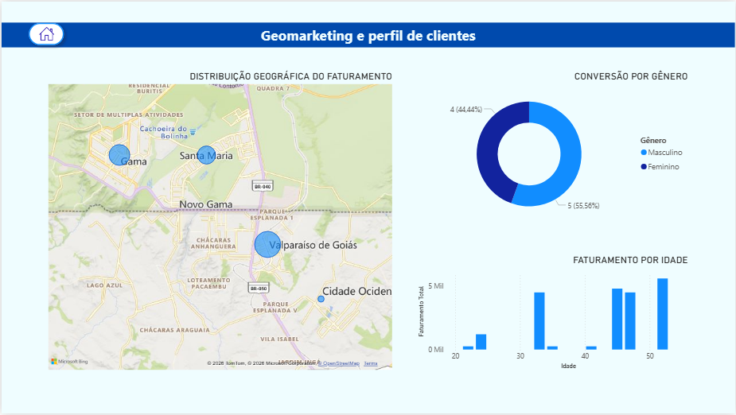

# 📍 Geomarketing para Clínica Odontológica (MaisOdonto)

Este projeto aplica conceitos de **Geomarketing** utilizando o Power BI para analisar a distribuição geográfica de clientes, identificar oportunidades de mercado e otimizar estratégias de captação e fidelização para a clínica odontológica **MaisOdonto**.

---

## 🎯 Objetivo do Projeto
O principal objetivo deste dashboard é transformar dados brutos de localização e comportamento dos pacientes em insights estratégicos, respondendo a perguntas como:
* Onde estão concentrados os nossos clientes mais lucrativos?
* Quais regiões possuem alta densidade populacional, mas baixa penetração da nossa marca?
* Como otimizar investimentos em tráfego pago (anúncios) baseando-se na geolocalização?
* Qual o impacto da distância física na taxa de retorno dos pacientes?

---

## 🛠️ Tecnologias e Ferramentas Utilizadas
* **Power BI Desktop**: Construção do modelo de dados, cálculos e visuais de mapas.
* **Linguagem DAX**: Criação de métricas de inteligência de tempo, penetração de mercado e segmentação.
* **Power Query (M)**: Tratamento, limpeza e enriquecimento dos dados de endereço.
* **Geocodificação**: Ajuste de latitude e longitude para alta precisão nos mapas.

---

## 📊 Funcionalidades do Dashboard
* **Análise de Densidade**: Mapas de calor mostrando a real concentração dos pacientes.
* **Faturamento por Região**: Cruzamento de dados financeiros com dados demográficos.

---

## 📂 Estrutura do Repositório
Para demonstrar boas práticas de engenharia e análise de dados, este repositório utiliza o formato de projeto do Power BI (`.pbip`), permitindo o versionamento de código aberto:
* `Geomarketing_MaisOdonto.Report/`: Contém os códigos de definição visual das telas.
* `Geomarketing_MaisOdonto.Dataset/`: Contém a estrutura de modelagem e relacionamentos de dados.
* `Geomarketing_MaisOdonto.pbix`: Arquivo completo para download e execução local.

---

## 🧑‍💻 Autora
Desenvolvido por **Kamila Soares Lago**  
* Conecte-se comigo no [LinkedIn](https://www.linkedin.com/in/kamilaslago/ 🚀
